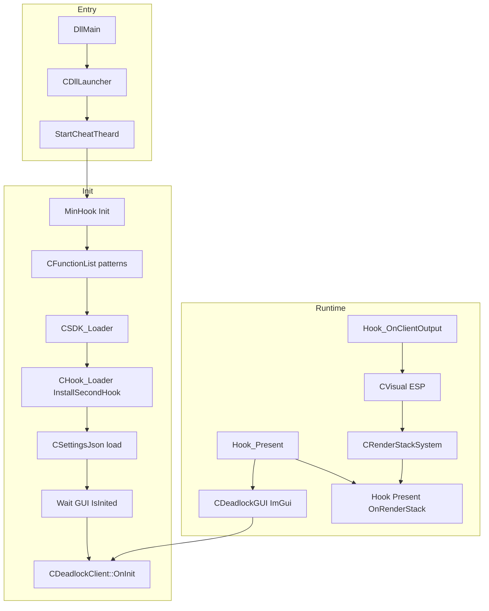

# Deadlock ESP

> **Build output:** `Deadlock.dll` (Visual Studio solution `Deadlock.sln`, project `Deadlock/Deadlock.vcxproj`)  
> **Display name (in-menu):** `vcme private` v`1.1.1` - see `Common/Include/Config.hpp`

---

## Table of contents

| Section | Document |
|--------|----------|
| Overview & architecture | [docs/architecture.md](docs/architecture.md) |
| Folder & file map | [docs/project-structure.md](docs/project-structure.md) |
| Startup, hooks, render loop | [docs/execution-flow.md](docs/execution-flow.md) |
| ImGui menu & settings UI | [docs/gui.md](docs/gui.md) |
| ESP / visual features | [docs/esp.md](docs/esp.md) |
| JSON configs & persistence | [docs/config.md](docs/config.md) |
| SDK, schema, entities | [docs/sdk-and-game-data.md](docs/sdk-and-game-data.md) |
| Extending the codebase safely | [docs/development-guide.md](docs/development-guide.md) |

---

## 1. What this project is

This repository builds a **Windows x64 DLL** that loads into the **Deadlock** game process (Valve Source 2 / Citadel). It is not a standalone application.

At runtime it:

- Resolves game interfaces and function pointers via **byte patterns**
- Installs **MinHook** detours on engine, client, overlay, and input paths
- Maintains a lightweight **entity cache** driven by add/remove entity hooks
- Draws **overlay visuals** (ESP, bones, footstep markers) through a deferred render stack
- Presents an **ImGui** menu (toggle: **Insert**) over the game via DXGI / Steam overlay Present hook
- Persists user settings as **JSON** files next to the DLL

**Out of scope for this documentation:** injection method, anti-cheat, or distribution - only in-process behavior documented from source.

---

## 2. High-level architecture

| Layer | Location | Role |
|-------|----------|------|
| Entry / lifecycle | `DeadlockMod/DllMain.*`, `DllLauncher.*` | DLL attach, paths, init thread, teardown |
| Hooks | `DeadlockMod/DeadLock/Hook/*`, `CHook_Loader.*` | MinHook detours, pattern scan |
| SDK | `DeadlockMod/DeadLock/SDK/*` | Interfaces, schema offsets, math, types |
| Game helpers | `DeadlockMod/GameClient/*` | Local player, bones, entity cache |
| Features / UI | `DeadlockMod/DeadlockClient/*` | ESP, menu, fonts, render stack, settings |
| Shared | `DeadlockMod/Common/*` | Logging, crash handler, ImGui, RapidJSON, MinHook |

---

## 3. Build & layout

### Solution

| Item | Path |
|------|------|
| Solution | `Deadlock.sln` |
| Project | `Deadlock/Deadlock.vcxproj` |
| Source root | `Deadlock/DeadlockMod/` |
| Output DLL name | **`Deadlock.dll`** (`TargetName` = `Deadlock`) |

Configurations in the solution map to **Release | x64** (primary) and Release | Win32.

### Include paths (x64 Release)

MSBuild adds:

- `$(ProjectDir)DeadlockMod\`
- `$(ProjectDir)DeadlockMod\Common\Include\`

Headers use angle includes such as `<DeadlockClient/...>`, `<DeadLock/...>`, `<GameClient/...>`, `<Common/...>`.

### Runtime files (DLL directory)

| File | Purpose |
|------|---------|
| `Deadlock.dll` | Injected module |
| `*.json` | User configs |
| `last_loaded_config.txt` | Auto-load stamp (filename only) |
| `gui.ini` | ImGui layout persistence |
| `debug.log` | Dev log when `ENABLE_CONSOLE_DEBUG` |

Linked libraries in project folder: `freetype.lib`, `FW1FontWrapperRel.lib`, `libprotobuf.lib`, `steam_api64.lib`, `VMProtectSDK64.lib` (usage varies by feature).

---

## 4. Runtime flow (summary)

Detailed steps: [docs/execution-flow.md](docs/execution-flow.md).

1. **`DllMain` (attach)** → `CDllLauncher::OnDllMain` → `CreateThread(StartCheatTheard)`
2. **Init thread:** MinHook → `CFunctionList::OnInit` (game function patterns) → `CSDK_Loader::LoadSDK` (interfaces + schema) → install all hooks → load config → wait until `CDeadlockGUI::IsInited()` → `CDeadlockClient::OnInit`
3. **First `Present`:** `CDeadlockGUI::OnInit` (D3D11 + ImGui + WndProc hook)
4. **Each frame `Present`:** ImGui frame → `CDeadlockClient::OnRender` → menu + watermark + `CRenderStackSystem::OnRenderStack`
5. **`OnClientOutput` (engine):** `CVisual::OnClientOutput` (queue ESP draw commands) → `CRenderStackSystem::OnClientOutput` (swap write buffer)
6. **Unload / destroy:** `DllMain` detach or WM_CLOSE → hooks removed, GUI destroyed, crash log torn down

---

## 5. Feature overview

### GUI ([docs/gui.md](docs/gui.md))

- **Insert** toggles menu visibility and mouse capture
- Left panel: config file list; right panel: tabs **Config**, **Visual**, **Misc**
- Four ImGui themes; menu alpha slider

### ESP ([docs/esp.md](docs/esp.md))

| Setting | `Settings::Visual` | Behavior |
|---------|-------------------|----------|
| Player ESP | `Active` | Master toggle for box ESP |
| Enemy ESP | `EnemyEsp` | Non-teammate players |
| Team ESP | `TeamEsp` | Same-team players |
| Show Hero Name | `ShowHeroName` | Label above box (HeroID table) |
| Show Health | `ShowHealth` | Numeric HP below box (`current/max` from `PlayerDataGlobal`) |
| Show Health Bar | `ShowHealthBar` | Team-colored bar under box (requires box ESP path) |
| Footstep ESP | `SoundStepEsp` | 3D circles at enemy footstep sounds |
| Bones ESP | `BonesEsp` | Skeleton lines via bone pairs |

### Config ([docs/config.md](docs/config.md))

- RapidJSON serialize/deserialize of `Settings::*` namespaces
- Default fallback: `config.json` if no stamp
- Colors: `SoundStepEsp` RGB saved but **not wired to live drawing** (footsteps use fixed yellow in code)

---

## 6. Hooks (inventory)

All installed in `CHook_Loader::InstallSecondHook` via pattern scan + MinHook.

| Hook | Module | Triggers |
|------|--------|----------|
| `Hook_Present` | `gameoverlayrenderer64.dll` | DXGI Present → GUI init/render |
| `Hook_ResizeBuffers` | overlay | Destroys GUI (RTV reset) |
| `Hook_CreateSwapChain` | overlay | Clears RTV on swap chain create |
| `Hook_OnClientOutput` | `engine2.dll` | ESP update + render stack publish |
| `Hook_OnAddEntity` / `OnRemoveEntity` | `client.dll` | Entity cache |
| `Hook_CreateMove` | `client.dll` | `CDeadlockClient::OnCreateMove` (empty) |
| `Hook_ParseMessage` | `engine2.dll` | Footstep sound events |
| `Hook_FireEventClientSide` | `client.dll` | Game events (handler empty) |
| `Hook_MouseInputEnabled` | `client.dll` | Blocks input when menu open |
| `Hook_IsRelativeMouseMode` | `inputsystem.dll` | Mouse mode when menu open |
| `Hook_GetMatricesForView` | `client.dll` | Passthrough only (no cheat logic) |

---

## 7. Screenshots & visuals

Existing marketing image is embedded at the top of this README.

### Placeholders (capture locally after build)

| Slot | Suggested capture |
|------|-------------------|
| **Menu overview** | Full window with left config list + right tabs |
| **Visual tab** | All ESP toggles visible |
| **Misc tab** | Menu style combo + alpha slider |
| **Config tab** | Load/Save/Create buttons |
| **ESP example** | In-match with Enemy ESP + boxes |
| **Bones ESP** | Skeleton overlay on players |
| **Footstep ESP** | Yellow shrinking circles on ground |
| **Hero labels** | `Show Hero Name` enabled |
| **Health ESP** | `Show Health` / `Show Health Bar` on enemies and teammates |

Replace placeholders by adding images under `docs/images/` and linking them here.

---

## 8. Technical debt & fragile areas

| Area | Risk | Notes |
|------|------|-------|
| Pattern signatures | **High** | Every game update can break `CBasePattern` / hook scans |
| Schema offsets | **High** | `CSchemaOffset` + generated entity headers must match build |
| `Offsets.hpp` constants | **High** | Hardcoded protobuf/layout offsets in `Hook_ParseMessage` |
| `Hook_GetMatricesForView` | Low | Hook installed but only forwards to original |
| `CDeadlockClient::OnCreateMove` | N/A | Stub - no aim/move features |
| `Settings::Colors::Visual::SoundStepEsp` | Medium | Saved/loaded but not applied in `CVisual::OnRenderSound` |
| Hero ID table | Medium | Partial static table; unknown IDs show numeric fallback |
| Overlay Present hook | Medium | Depends on Steam overlay DXGI path |
| `gui.ini` child IDs | Low | Renamed from `Andromeda*` → `Deadlock*`; old layouts may reset |

---

## 9. Undocumented / uncertain from code alone

- Exact **injector** and whether **manual map** (`ManualMapParam_t`) is always used
- Full list of **protobuf** message handlers beyond `GE_SosStartSoundEvent`
- Whether **VMProtect** / **XorStr** macros are enabled in your local build (`ENABLE_XOR_STR` = 0 in `Config.hpp` for `RELEASE_BUILD`)
- **Win32** project configuration include paths (only x64 sets `IncludePath` explicitly in vcxproj)
- Complete **schema dump** output (gated by `DUMP_SCHEMA_*` flags, default off)

---

## 10. Quick reference - key singletons

| Accessor | Type | Role |
|----------|------|------|
| `GetDllLauncher()` | `CDllLauncher*` | Paths, module image bounds |
| `GetHook_Loader()` | `CHook_Loader*` | MinHook lifecycle |
| `GetFunctionList()` | `CFunctionList*` | Pattern-scanned game functions |
| `GetSDK_Loader()` | `CSDK_Loader*` | One-shot SDK init |
| `GetDeadlockGUI()` | `CDeadlockGUI*` | D3D11 / ImGui |
| `GetDeadlockClient()` | `CDeadlockClient*` | Feature orchestration |
| `GetDeadlockMenu()` | `CDeadlockMenu*` | Menu widgets |
| `GetVisual()` | `CVisual*` | ESP |
| `GetEntityCache()` | `CEntityCache*` | Cached controllers/pawns |
| `GetRenderStackSystem()` | `CRenderStackSystem*` | Deferred draws |
| `GetSettingsJson()` | `CSettingsJson*` | Config files |
| `GetCL_CitadelPlayerController()` | `CL_CitadelPlayerController*` | Local controller |
| `GetCL_Bones()` | `CL_Bones*` | Bone positions |

---

# Screenshots

| Screenshot | Description |
|---|---|
|  | Full menu (500×400) |
|  | Config tab |
|  | Visual / ESP toggles |
|  | Menu style + alpha |
|  | Player ESP boxes |
|  | Bones ESP |
|  | Footstep circles |
|  | Hero name labels |
|  | Health text and bar below ESP boxes |
