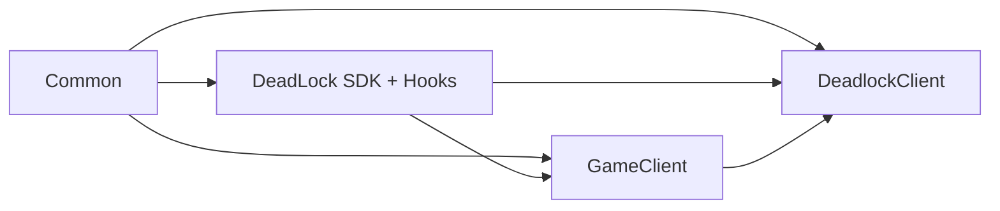
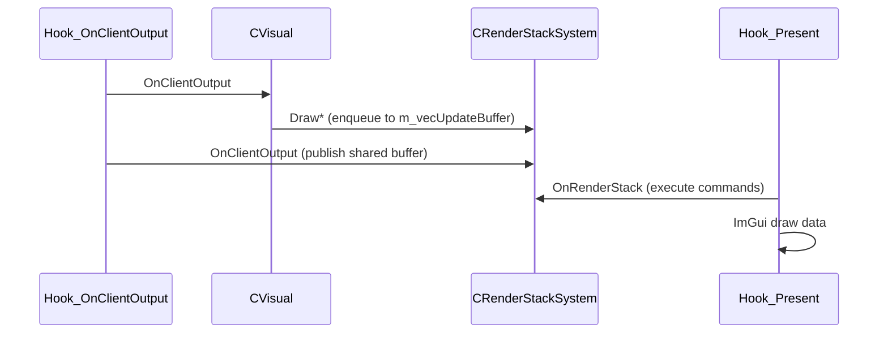

# Architecture

[← README](../README.md)

## Design goals (as implemented)

The codebase separates concerns into four cooperating layers:

1. **Bootstrap** — DLL entry, threading, logging, crash handling, directory discovery
2. **Integration** — Pattern scanning, MinHook, Source 2 interfaces, schema-backed types
3. **Game state** — Entity cache, local player accessors, bone helpers
4. **Presentation** — Deferred 2D/3D draw list, ImGui menu, runtime `Settings` namespace

There is no central “plugin” registry. Features are wired through **singleton accessors** (`GetVisual()`, `GetDeadlockClient()`, etc.) and **hook trampolines** that call into those singletons.

## Module dependency graph



| Module | Depends on | Must not depend on |
|--------|------------|-------------------|
| `Common` | Win32, STL, bundled libs | `DeadlockClient`, game types |
| `DeadLock` | `Common`, game DLLs at runtime | ImGui menu code |
| `GameClient` | `DeadLock` SDK types | ImGui |
| `DeadlockClient` | All above | — |

## Singleton pattern

Most subsystems use a file-scope static instance and `GetX()` accessor:

```cpp
static CVisual g_CVisual{};
auto GetVisual() -> CVisual* { return &g_CVisual; }
```

Interfaces (`IVisual`, `IDeadlockGUI`, `IEntityCache`) exist for some types but only have a single concrete implementation each.

## Threading model

| Thread | Work |
|--------|------|
| Game / render thread | Hooks (`Present`, `OnClientOutput`, entity hooks, input hooks) |
| Init thread | `StartCheatTheard` — blocking init then exits |
| ImGui | Same thread as `Present` (assumed) |

Synchronization:

- `CEntityCache` — `std::recursive_mutex`
- `CVisual::m_SoundLock` — `std::mutex` for footstep list
- `CRenderStackSystem` — `std::mutex` on buffer swap

**Assumption:** Hook callbacks run on the same thread that calls Present; cross-thread ImGui use is not guarded beyond mutexes on data structures.

## Render pipeline architecture

Two-phase rendering avoids drawing during entity iteration on the wrong ImGui frame state:



- **Enqueue:** `CRenderStackSystem::DrawLine`, `DrawOutlineCoalBox`, `DrawString`, etc. append `std::shared_ptr<IRenderObject>` to `m_vecUpdateBuffer`
- **Publish:** `OnClientOutput` moves buffer to atomic `m_pSharedBuffer`
- **Consume:** `OnRenderStack` (called from `CDeadlockClient::OnRender` inside Present) runs each object's `OnRender()` → `CRender` ImGui draw lists

## Configuration architecture

Runtime state lives in **`namespace Settings`** (`Settings.hpp`) — plain inline globals.

Persistence is **`CSettingsJson`** — reads/writes JSON files in `GetDllDir()` and updates `Settings::*` on load; reads `Settings::*` on save.

There is no validation layer beyond clamping ints and rejecting bad stamp paths.

## Hook architecture

`CHook_Loader` owns a vector of `HookData_t` entries:

- `CBasePattern` — name, byte pattern, DLL name
- Detour function pointer
- Original trampoline pointer (`*_o`)

Flow:

1. `InitalizeMH()` → `MH_Initialize`
2. `InstallSecondHook()` — populate vector, `InstallHooks()`
3. For each hook: wait for module, `Search()`, `MH_CreateHook`, then `MH_EnableHook(MH_ALL_HOOKS)`
4. `DestroyHooks()` on unload — disable + uninitialize

Patterns target **Steam overlay** for DXGI (not `client.dll` Present), which is a deliberate choice for drawing on top of the game.

## SDK architecture

`CSDK_Loader::LoadSDK()`:

1. Waits for `navsystem.dll` (proxy for game readiness)
2. Resolves `SDK::Interfaces::*` (schema, engine, entity system, input, sound)
3. Resolves `SDK::Pointers::GetFirstCUserCmdArray()`
4. `SDL3_Functions::OnInit()` for mouse warp when menu opens
5. `CSchemaOffset::Init()` — walks schema scopes (optional dump flags)

Game function pointers used by features are resolved earlier in **`CFunctionList::OnInit()`** (e.g. `ScreenTransform`, `GetBaseEntity`, bone helpers).

## Extension points (safe)

| Location | Use for |
|----------|---------|
| `CDeadlockClient::OnCreateMove` | Movement / aim (currently empty) |
| `CDeadlockClient::OnFireEventClientSide` | Game event reactions (empty) |
| `CVisual::OnRender` / `OnClientOutput` | New ESP types |
| `CDeadlockMenu::Render*TabContent` | New menu tabs |
| `CSettingsJson::LoadConfig` / `SaveConfig` | New persisted settings |
| New hook entry in `CHook_Loader::InstallSecondHook` | New engine callbacks |

## Extension points (dangerous)

| Location | Risk |
|----------|------|
| `CEntityData` / schema macros | Game update breaks layouts |
| `Offsets.hpp` | Hardcoded struct layout |
| `Hook_ParseMessage` | Protobuf layout drift |
| WndProc replacement | Input / focus bugs |
| Calling game virtuals without pattern refresh | Crash |
