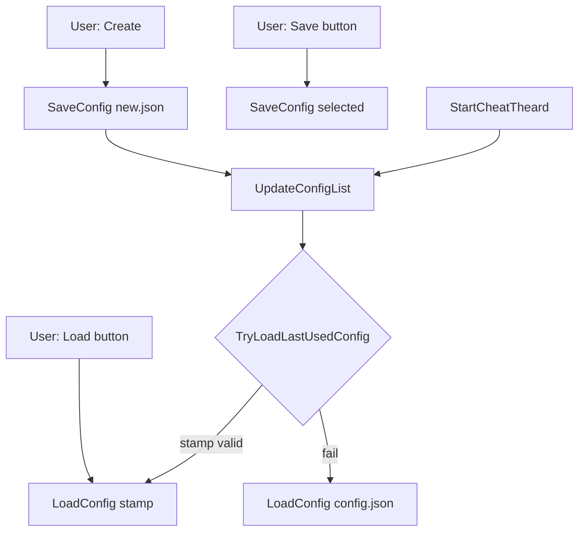

# Configuration system

[← README](../README.md)

**Implementation:** `DeadlockClient/Settings/CSettingsJson.cpp`  
**Runtime state:** `DeadlockClient/Settings/Settings.hpp`  
**Constants:** `Common/Include/Config.hpp`

---

## Storage model

| Concept | Implementation |
|---------|----------------|
| Live settings | C++ inline globals in `namespace Settings` |
| Persistence | One JSON file per config in **DLL directory** |
| Active file tracking | `CSettingsJson::m_nConfigLoadedIndex` + `last_loaded_config.txt` |
| Discovery | `std::filesystem::directory_iterator` for `*.json` |

There is no encryption, cloud sync, or per-user roaming path — everything is local to `GetDllDir()`.

---

## File names (Config.hpp)

| Macro | Default | Purpose |
|-------|---------|---------|
| `CONFIG_FILE` | `"config.json"` | Fallback when no stamp |
| `LAST_LOADED_CONFIG_STAMP_FILE` | `"last_loaded_config.txt"` | Single-line filename |
| `GUI_FILE` | `"gui.ini"` | ImGui layout (separate from JSON) |
| `LOG_FILE` | `"debug.log"` | Dev log output |

---

## JSON schema (as implemented)

Root object with single key `"Settings"`:

```json
{
  "Settings": {
    "Visual": {
      "Active": false,
      "SoundStepEsp": false,
      "BonesEsp": false,
      "EnemyEsp": false,
      "TeamEsp": false,
      "ShowHeroName": false,
      "ShowHealth": false,
      "ShowHealthBar": false
    },
    "Misc": {
      "MenuAlpha": 200,
      "MenuStyle": 0
    },
    "Colors": {
      "Visual": {
        "SoundStepEsp": [0.0, 0.0, 0.0]
      }
    }
  }
}
```

### Load behavior (`LoadConfig`)

| Section | Keys | Notes |
|---------|------|-------|
| Visual | `Active`, `SoundStepEsp`, `BonesEsp`, `EnemyEsp`, `TeamEsp` | bool |
| Visual | `ShowHeroName` | Preferred key |
| Visual | `ShowHeroId` | **Legacy alias** — used if `ShowHeroName` absent |
| Visual | `ShowHealth`, `ShowHealthBar` | bool |
| Misc | `MenuAlpha` | clamped 100–255 |
| Misc | `MenuStyle` | clamped 0–3 |
| Colors.Visual | `SoundStepEsp` | RGB array [0–1] each |

On successful parse → `WriteLastLoadedConfigStamp(JsonFile)`.

### Save behavior (`SaveConfig`)

Writes all fields above (including `ShowHealth`, `ShowHealthBar`; always `ShowHeroName`, not legacy id). Pretty-printed with tabs indent.

---

## Load / save flow



### `TryLoadLastUsedConfig`

1. Read `last_loaded_config.txt` from DLL dir
2. Trim whitespace; reject paths with `/`, `\`, `:`, `..`
3. Must end with `.json` (case-insensitive)
4. File must exist
5. Call `LoadConfig(name)`

### `UpdateConfigList`

Clears `m_vecConfigList`, enumerates `GetDllDir()` for regular files with `.json` extension (filename only, not full path).

### `DeleteConfig`

`DeleteFileA` on `GetDllDir() + JsonFile` — does not clear stamp if deleted file was active.

---

## Menu integration

| UI action | Code path |
|-----------|-----------|
| List display | `GetConfigList()` |
| Selection index | `m_nConfigSelected` (menu) vs `m_nConfigLoadedIndex` (active) |
| Load | `LoadConfig` + `UpdateStyle()` |
| Create | `SaveConfig` new name + refresh list |

`CDeadlockClient::OnInit` sets `m_nConfigSelected` from `GetConfigLoadedIndex()` so UI matches auto-load.

---

## Persistence vs runtime

| Field | Saved | Used in ESP |
|-------|-------|-------------|
| Visual toggles | Yes | Yes |
| Misc menu | Yes | Yes |
| `Colors.Visual.SoundStepEsp` | Yes | **No** — footsteps use hardcoded yellow |

Changing color in JSON alone will not affect footstep color until `CVisual::OnRenderSound` reads settings.

---

## Compatibility notes

- Renaming config files on disk requires **Refresh list** or restart
- Old configs with only `ShowHeroId` still load hero name toggle correctly
- ImGui `gui.ini` is independent — deleting it resets window layout only
- Stamp file stores **filename only** (e.g. `my.json`), not full path

---

## API reference (`CSettingsJson`)

| Method | Description |
|--------|-------------|
| `LoadConfig` | Parse JSON → `Settings::*`, update loaded index |
| `SaveConfig` | `Settings::*` → JSON file |
| `DeleteConfig` | Remove file |
| `UpdateConfigList` | Rescan directory |
| `GetConfigList` | Const ref to vector |
| `GetConfigLoadedIndex` | Active config index |
| `TryLoadLastUsedConfig` | Stamp-based auto load |
| `WriteLastLoadedConfigStamp` / `ReadLastLoadedConfigStamp` | Private stamp I/O |

Helpers: `GetBoolJson`, `GetIntJson`, `GetColorJson`, `AddBoolJson`, etc.

---

## Error handling

- Missing file on load → log `[error] LoadConfig: cannot open`, return `false`
- Parse error → log RapidJSON error + offset, return `false`
- Invalid stamp → silent fail → fallback `config.json`
- Empty config list → UI shows "(no .json files)"; Load/Save/Delete disabled via `ConfigExist`

---

## Example: adding a new setting

1. Add inline variable to `Settings.hpp`
2. `GetBoolJson` / `AddBoolJson` in `LoadConfig` / `SaveConfig`
3. Add `RenderCheckBox` in appropriate menu tab
4. Use variable in feature code

No versioning field exists in JSON — forward compatibility is best-effort (unknown keys ignored on load).
