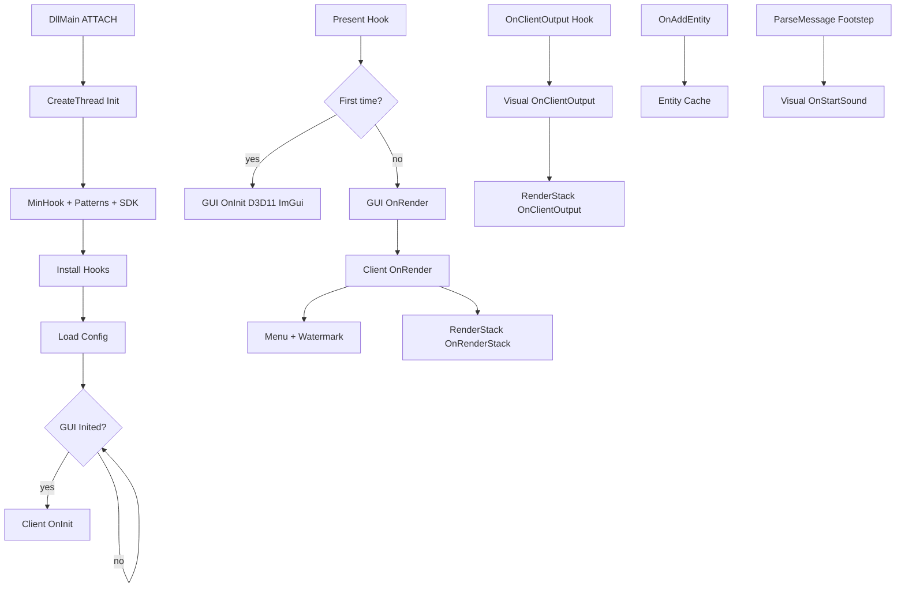

# Execution flow

[← README](../README.md)

## 1. DLL attach

**File:** `DeadlockMod/DllMain.cpp`

```
DLL_PROCESS_ATTACH
  → DisableThreadLibraryCalls
  → CDllLauncher::OnDllMain(lpReserved, hInstance)
```

**File:** `DeadlockMod/DllLauncher.cpp` — `OnDllMain`

1. Resolve **DLL directory** `m_DllDir`:
   - If `lpReserved` → cast to `ManualMapParam_t*`, use `m_DllDir` (strip to folder)
   - Else → `GetModuleFileNameA` on DLL module
2. Resolve **game directory** `m_DeadLockDir` from main executable path
3. Store PE `SizeOfImage` / `BaseOfCode` for `IsCheatAddress()`
4. `CreateThread(StartCheatTheard, lpReserved)`

No heavy work runs on the loader thread beyond spawning init.

---

## 2. Initialization thread

**Function:** `CDllLauncher::StartCheatTheard`

| Step | Component | Failure behavior |
|------|-----------|------------------|
| 1 | `GetDevLog()->Init()` | — |
| 2 | `GetCrashLog()->InitVectorExceptionHandler()` | — |
| 3 | `GetHook_Loader()->InitalizeMH()` | Log error, **thread returns 0** |
| 4 | `GetFunctionList()->OnInit()` | Pattern scan all game functions |
| 5 | `GetSDK_Loader()->LoadSDK()` | Wait `navsystem.dll`, interfaces, SDL3, schema |
| 6 | `GetHook_Loader()->InstallSecondHook()` | Install + enable all hooks |
| 7 | `GetSettingsJson()->UpdateConfigList()` | Scan `*.json` in DLL dir |
| 8 | `TryLoadLastUsedConfig()` or `LoadConfig(CONFIG_FILE)` | Default `config.json` |
| 9 | `while (!GetDeadlockGUI()->IsInited()) Sleep(100)` | Block until first Present init |
| 10 | `GetDeadlockClient()->OnInit()` | Sync menu config selection index |

**Note:** Hooks are live before GUI init completes; `OnClientOutput` may run before ImGui exists. ESP enqueue still occurs; `OnRenderStack` only runs once Present path is active.

---

## 3. First Present (GUI bootstrap)

**Chain:** `Hook_Present` → `CDeadlockGUI::OnPresent`

If `!m_bInit`:

- `OnInit(pSwapChain)`:
  - Get D3D11 device + context from swap chain
  - Window handle from swap chain desc
  - Create ImGui context; `IniFilename` = `GetDllDir() + "gui.ini"`
  - `ImGui_ImplWin32_Init` + `ImGui_ImplDX11_Init`
  - Load Tahoma + Font Awesome compressed font
  - `InitIndigoStyle()` default theme
  - Replace game window `WndProc` with `GUI_WndProc`

Subsequent Present calls → `OnRender`.

---

## 4. Per-frame Present (render loop)

**`CDeadlockGUI::OnRender`**

1. Optional FreeType font rebuild → invalidate D3D11 ImGui objects
2. Create `m_pRenderTargetView` if missing (from back buffer)
3. Save OM render targets; bind cheat RTV
4. `ImGui_ImplDX11_NewFrame` / `ImGui_ImplWin32_NewFrame` / `ImGui::NewFrame`
5. **`GetDeadlockClient()->OnRender()`**
6. `ImGui::EndFrame` / `ImGui::Render` / `ImGui_ImplDX11_RenderDrawData`
7. Restore original render targets

**`CDeadlockClient::OnRender`**

1. If menu visible → `CDeadlockMenu::OnRenderMenu()`
2. `CFontManager::FirstInitFonts()` (FW1 font wrapper)
3. Draw cheat name top-left (`CHEAT_NAME` from Config.hpp)
4. **`CRenderStackSystem::OnRenderStack()`** — flush queued ESP primitives

---

## 5. Engine output tick (ESP update)

**Chain:** `Hook_OnClientOutput` → original

```cpp
GetDeadlockClient()->OnClientOutput();
GetRenderStackSystem()->OnClientOutput();
return OnClientOutput_o(...);
```

**`CDeadlockClient::OnClientOutput`**

- If `EngineToClient()->IsInGame()` → `CVisual::OnClientOutput()`

**`CVisual::OnClientOutput`**

1. `EnsureUpdateCapacity(768)`
2. `OnRender()` — player box ESP from entity cache
3. If `BonesEsp` → `FOR_EACH_ENTITY` scan controllers, skeleton lines

**`CRenderStackSystem::OnClientOutput`**

- Move `m_vecUpdateBuffer` to shared pointer for Present thread

Timing: ESP geometry is computed on **engine output**; drawn on **next Present** (typically same frame or next, depending on game ordering).

---

## 6. Entity lifecycle

**Add:** `Hook_OnAddEntity` → `CDeadlockClient::OnAddEntity` → `CEntityCache::OnAddEntity`

- Classify `C_BaseEntity` → `CITADEL_PLAYER_CONTROLLER` or `CITADEL_PLAYER_PAWN`
- Store `CHandle` + type in vector (dedupe by handle)

**Remove:** `Hook_OnRemoveEntity` → mark `UNKNOWN`, erase from vector

ESP iteration uses cache for boxes; bone ESP uses live `FOR_EACH_ENTITY` index scan (not cache-only).

---

## 7. Sound / footstep path

**Chain:** `Hook_ParseMessage` (when `messageID == GE_SosStartSoundEvent`)

1. Read protobuf `CMsgSosStartSoundEvent` at offset `g_OFFSET_CDemoRecorder_ParseMessage_pProtobuf`
2. Extract entity index, sound position, hash → name via `SoundOpSystem`
3. `CDeadlockClient::OnStartSound` → `CVisual::OnStartSound`
4. If name contains `"Footstep"`, enemy pawn, not local → append to `m_SoundList` with timestamp

Rendering: `CVisual::OnRenderSound` during `OnRender()` if `SoundStepEsp` enabled.

---

## 8. Input / menu

| Input | Handler |
|-------|---------|
| **Insert** (keyup) | `GUI_WndProc` → `OnReopenGUI()` toggle `m_bVisible` |
| Menu visible | `ImGui_ImplWin32_WndProcHandler` eats messages |
| `Hook_MouseInputEnabled` | Returns false if menu visible |
| `Hook_IsRelativeMouseMode` | Forces non-relative when menu visible; stores `m_bMainActive` |

`OnReopenGUI` also warps mouse via SDL3 when entering menu in-game.

---

## 9. Shutdown / unload

**Triggers:**

- `DLL_PROCESS_DETACH` → `CDllLauncher::OnDestroy()`
- `WM_QUIT` / `WM_CLOSE` / `WM_DESTROY` in `GUI_WndProc` → `OnDestroy()`

**`OnDestroy` order:**

1. `GetDevLog()->Destroy()`
2. `GetHook_Loader()->DestroyHooks()` (MinHook disable + uninit)
3. `GetDeadlockGUI()->OnDestroy()` (restore WndProc, release ImGui/D3D)
4. `GetCrashLog()->DestroyVectorExceptionHandler()`
5. Set `m_bDestroyed` guard

**Caveat:** Full unload while game still running is fragile (hooks removed while game threads may still call trampolines). Treat as best-effort.

---

## 10. Flow diagram (full)


