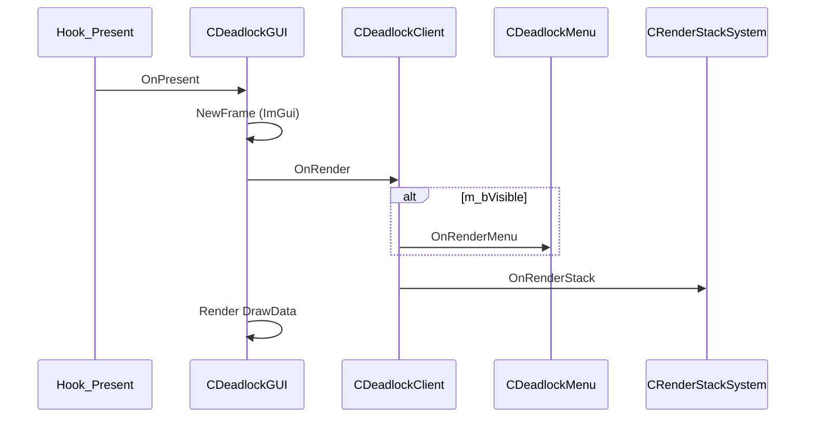

# GUI system

[← README](../README.md)

## Overview

The menu is **Dear ImGui** rendered with **Direct3D 11** on the game's swap chain, hooked through **Steam overlay** `Present` (`gameoverlayrenderer64.dll`).

| Component | File |
|-----------|------|
| D3D11 / ImGui lifecycle | `DeadlockClient/CDeadlockGUI.cpp` |
| Menu layout & widgets | `DeadlockClient/GUI/CDeadlockMenu.cpp` |
| Runtime style values | `DeadlockClient/Settings/Settings.hpp` |
| ImGui ini persistence | `gui.ini` in DLL directory |
| Theme implementations | `CDeadlockGUI::Init*Style()` |

**Toggle:** `Insert` key (keyup) — `GUI_WndProc` → `OnReopenGUI()`.

---

## Window layout

```
┌─────────────────────────────────────────────────────────┐
│  CHEAT_NAME (window title)                    [animated]│
├──────────────┬──────────────────────────────────────────┤
│ Configs      │  [ Config ] [ Visual ] [ Misc ]          │
│  list        │                                          │
│  (buttons)   │  (active tab content)                    │
│              │                                          │
└──────────────┴──────────────────────────────────────────┘
```

Constants (`CDeadlockMenu.hpp`):

| Constant | Value | Meaning |
|----------|-------|---------|
| `g_MainWindowSizeX` | 500 | Window width |
| `g_MainWindowSizeY` | 400 | Window height |
| `g_ChildSizeX` | 150 | Left panel width |
| `g_ButtonSizeY` | 30 | Icon button height |

### Left child — `RenderLeftChild()`

- Child ID: `"DeadlockChildLeft"`
- Lists all `*.json` configs from `CSettingsJson::GetConfigList()`
- Button per file; click sets `m_nConfigSelected`
- Color labels:
  - **Green** — loaded and selected
  - **Green "Loaded"** — active config
  - **Orange "Selected"** — selected but not loaded

### Right child — `RenderRightChild()`

- Child ID: `"DeadlockChildRight"`
- `ImGui::BeginTabBar("##MainSettingsTabBar")` with three tabs

---

## Tab: Config

**Function:** `RenderConfigTabContent()`

| Control | Action |
|---------|--------|
| Status text | Shows currently loaded config filename |
| New file name | `m_szNewConfigFileName` (32 chars) |
| **Create** | `SaveConfig(name + ".json")`, refresh list |
| **Load** | `LoadConfig(selected)`, `UpdateStyle()` |
| **Save** | `SaveConfig(selected)` |
| **Delete** | `DeleteConfig(selected)`, refresh list |
| **Refresh list** | `UpdateConfigList()` |
| Footer | `CHEAT_NAME`, `CHEAT_VERSION`, build date/time |

Uses Font Awesome icons via `ButtonIcon()` (icon font + text button).

---

## Tab: Visual

**Function:** `RenderVisualTabContent()`

| UI label | Settings field | Type |
|----------|----------------|------|
| Player ESP | `Settings::Visual::Active` | bool |
| Enemy ESP | `Settings::Visual::EnemyEsp` | bool |
| Team ESP | `Settings::Visual::TeamEsp` | bool |
| Show Hero Name | `Settings::Visual::ShowHeroName` | bool |
| Show Health | `Settings::Visual::ShowHealth` | bool |
| Show Health Bar | `Settings::Visual::ShowHealthBar` | bool |
| Footstep ESP | `Settings::Visual::SoundStepEsp` | bool |
| Bones ESP | `Settings::Visual::BonesEsp` | bool |

All use `RenderCheckBox()` — label left, checkbox right-aligned.

**Note:** Sub-features require `Active` for box ESP; bones/footsteps have additional gates in code (see [esp.md](esp.md)).

---

## Tab: Misc

**Function:** `RenderMiscTabContent()`

| UI label | Settings field | Range / values |
|----------|----------------|----------------|
| Menu alpha | `Settings::Misc::MenuAlpha` | 100–255 (applied as ImGui style alpha) |
| Menu style | `Settings::Misc::MenuStyle` | 0–3 combo |

Combo options:

| Index | Style | Init function |
|-------|-------|---------------|
| 0 | Indigo | `InitIndigoStyle()` |
| 1 | Vermillion | `InitVermillionStyle()` |
| 2 | Classic Steam | `InitClassicSteamStyle()` |
| 3 | Charcoal | `InitCharcoalStyle()` |

Changing style calls `GetDeadlockGUI()->UpdateStyle()` immediately.

---

## Rendering flow



Menu alpha: `CDeadlockMenu::OnRenderMenu` pushes `ImGuiStyleVar_Alpha` from `MenuAlpha / 255.f`.

Border effect: `RenderRandomBorderColor()` draws HSV-animated rectangle on background draw list around main window.

---

## Menu state

| Field | Meaning |
|-------|---------|
| `m_bInit` | D3D11 + ImGui ready |
| `m_bVisible` | Menu shown; mouse captured |
| `m_bMainActive` | Last relative-mouse state from game |
| `m_vecMousePosSave` | Restores cursor when reopening menu |

`OnReopenGUI()`:

- Toggles visibility
- `MouseDrawCursor` / `ShowCursor` inverted
- Calls original `IsRelativeMouseMode` with forced mode when menu open
- Warps mouse to center (or saved pos) via SDL3 when visible and in-game

---

## Widget helpers (`CDeadlockMenu`)

| Method | Purpose |
|--------|---------|
| `ButtonIcon` | Font Awesome glyph + `ImGui::Button` |
| `RenderInputText` | Label + full-width input |
| `RenderCheckBox` | Label left, checkbox right |
| `RenderComboBox` | Label + combo |
| `RenderSliderInt` / `RenderSliderFloat` | Label + slider |

`RenderSliderFloat` exists but is **not used** in current tabs.

---

## Font system

**Init (`CDeadlockGUI::InitFont`):**

- Tahoma 15px from Windows Fonts folder
- Font Awesome compressed TTF at 25px for icons

**ESP / watermark (`CFontManager`):**

- FW1 font wrapper (`CFont`, `CFontManager`) initialized on first `OnRender`
- `m_VerdanaFont` draws cheat name and hero labels

FreeType: `FreeTypeBuild` can rebuild atlas (`IMGUI_ENABLE_FREETYPE`); triggers D3D11 object recreate on rebuild.

---

## Config integration

| Event | Config behavior |
|-------|-----------------|
| Init thread | Auto-load stamp or `config.json` |
| `CDeadlockClient::OnInit` | `SetConfigSelected(GetConfigLoadedIndex())` |
| Load button | `LoadConfig` + theme refresh |
| Create/Save | Writes JSON from current `Settings::*` |

Menu style / alpha are persisted under `Settings.Misc` in JSON.

---

## ImGui persistence

- **File:** `GetDllDir() + "gui.ini"`
- Stores window positions/sizes for ImGui windows
- Child IDs renamed to `Deadlock*` — old `Andromeda*` ini sections will not match (layouts reset once)

---

## Screenshots (placeholders)

Add captures under `docs/images/`:

1. `menu-overview.png` — full 500×400 window
2. `tab-config.png` — Config tab actions
3. `tab-visual.png` — ESP toggles
4. `tab-misc.png` — Style + alpha

---

## Known limitations

- `CDeadlockClient::OnFireEventClientSide` is empty — no game-event-driven UI
- No in-menu color picker for ESP colors despite JSON color support
- Menu does not render when `m_bVisible` false, but watermark + ESP still draw
- Resize buffers destroys entire GUI — user may see brief flicker on resolution change
