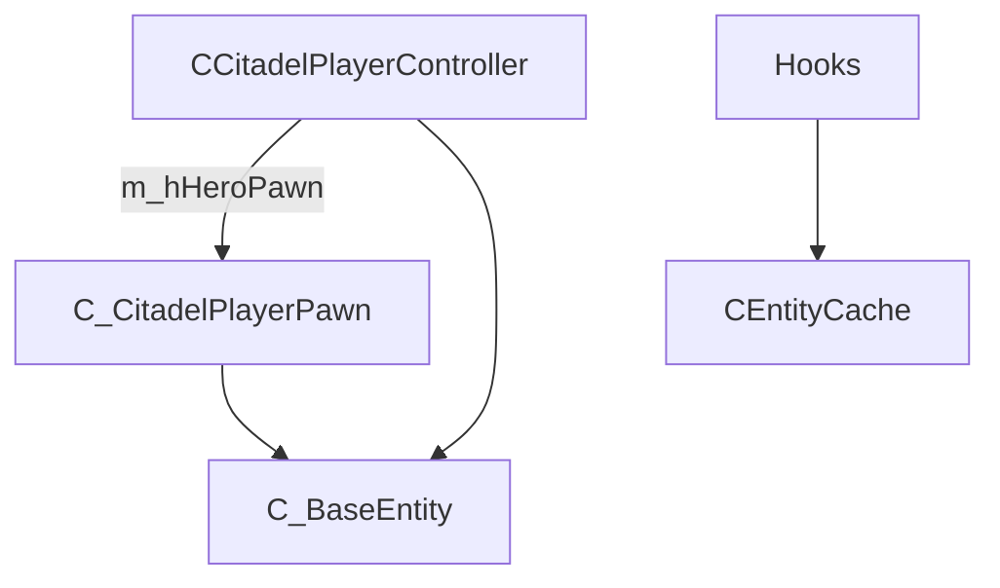

# SDK & game data

[← README](../README.md)

This project interfaces with **Deadlock** (Source 2) through a combination of:

1. **Exported / scanned functions** (`CFunctionList`, `CBasePattern`)
2. **Interface pointers** from factory patterns (`SDK::Interfaces`)
3. **Schema system** for class layouts (`CSchemaOffset`, `CEntityData.hpp`)
4. **Hardcoded offsets** (`Offsets.hpp`) for protobuf/network paths

---

## Game modules (SDK.hpp)

| Constant | DLL |
|----------|-----|
| `CLIENT_DLL` | `client.dll` |
| `ENGINE2_DLL` | `engine2.dll` |
| `NAVSYSTEM_DLL` | `navsystem.dll` |
| `GAMEOVERLAYRENDER64_DLL` | `gameoverlayrenderer64.dll` |
| `SCHEMASYSTEM_DLL` | `schemasystem.dll` |
| `INPUTSYSTEM_DLL` | `inputsystem.dll` |
| `SOUNDSYSTEM_DLL` | `soundsystem.dll` |

`CSDK_Loader` waits until `navsystem.dll` is loaded before proceeding.

---

## Interfaces (`SDK::Interfaces`)

Resolved during `CSDK_Loader::LoadSDK()`:

| Accessor | Used for |
|----------|----------|
| `SchemaSystem()` | Schema offset init |
| `EngineToClient()` | `IsInGame()` checks |
| `GameEntitySystem()` | Entity iteration, local player |
| `InputSystem()` | Mouse mode hook context |
| `SoundOpSystem()` | Footstep name from hash |

Failure of any interface → SDK load returns `false` → init thread aborts.

---

## Pointers (`SDK::Pointers`)

| Pointer | Purpose |
|---------|---------|
| `GetFirstCUserCmdArray()` | User command array (CreateMove hook context) |

---

## Function list (pattern-scanned)

**Init:** `CFunctionList::OnInit()` - all patterns must search successfully.

| Pattern member | Typical use in project |
|----------------|------------------------|
| `ScreenTransform` | `Math::WorldToScreen` |
| `CGameEntitySystem_GetBaseEntity` | Entity by index |
| `CGameEntitySystem_GetLocalCitadelPlayerController` | Local player |
| `C_BaseEntity_GetBoneIdByName` | Bone ESP |
| `CSkeletonInstance_CalcWorldSpaceBones` | Bone positions |
| `CCitadelInput_GetViewAngles` | Available, not used in ESP |
| `GetCUserCmd*` | CreateMove path (stub) |
| `IGameEvent_GetName` | FireEvent hook (stub) |
| `C_EnvSky_Update` | Scanned, unused in features |
| `C_BaseEntity_GetHitBoxSet` | Scanned, debug comments only |

Macros in `CFunctionList.hpp`:

```cpp
DECLARATE_DEADLOCK_FUNCTION_SDK_FASTCALL(...)
```

Generates inline wrappers calling the resolved original.

---

## Schema system

**Class:** `CShcemaOffset` (typo preserved in source: `CShcemaOffset`)

**`Init()`:**

1. Collect type scopes (global + `GetAllTypeScope()`)
2. Walk class containers / schema blocks
3. Optional dumps when `DUMP_SCHEMA_SCOPE_LIST` or `DUMP_SCHEMA_ALL_OFFSET` == 1

Entity field access in headers (e.g. `CEntityData.hpp`) uses schema-derived offsets - **exact macro style not duplicated here**; see generated/ hand-maintained types under `DeadLock/SDK/Types/`.

**Repo root:** `schema_dump.hpp` may contain supplemental dump output - verify freshness vs your game build before relying on it.

---

## Entity model (conceptual)



### `C_BaseEntity`

Base type from SDK headers. Methods used in project:

- `IsCitadelPlayerController()` / `IsCitadelPlayerPawn()`
- `m_iTeamNum()`
- `m_pGameSceneNode()` → skeleton / bones
- `GetBoneIdByName` (via function list)

### `CCitadelPlayerController`

- `m_hHeroPawn()` - handle to pawn
- `m_PlayerDataGlobal()` - alive state, hero ID, **current/max health** (`m_iHealth`, `m_iHealthMax`)
- Team number via `m_iTeamNum()`

### `C_CitadelPlayerPawn`

- `m_vOldOrigin()` - feet/world origin for ESP box
- Bone queries for `"head"` and skeleton pairs

### Handles - `CHandle`

Template handle type with `.Get<T>()` resolving through entity system. Cache stores handles and validates each frame against `pEntityIdentity()->Handle()`.

---

## Entity cache vs live scan

| Mechanism | Used by |
|-----------|---------|
| `CEntityCache` | Box ESP (`OnRender`) |
| `FOR_EACH_ENTITY` macro | Bones ESP |

Macro definition:

```cpp
for (auto idx = 0; idx <= GameEntitySystem()->GetHighestEntityIndex(); idx++)
```

---

## Hero ID

**Field:** `m_PlayerDataGlobal().m_nHeroID().m_Value` (uint32)

**Lookup:** `HeroIdLookup::g_HeroIdNameTable` - 38 entries, sorted, binary search.

**Fallback:** Numeric string when ID unknown (documented in `CHeroIdLookup.hpp`).

**Config legacy:** JSON key `ShowHeroId` still accepted on load.

---

## Hardcoded offsets (`Offsets.hpp`)

| Constant | Value | Usage |
|----------|-------|-------|
| `g_OFFSET_CUserCmdArray_m_nSequenceNumber` | `0x6270` | Commented reference |
| `g_OFFSET_CDemoRecorder_ParseMessage_pProtobuf` | `0x30` | `Hook_ParseMessage` |
| `g_OFFSET_CMsgSosStartSoundEvent_SoundPos` | `0x12` | Sound event position in packed params |
| `g_OFFSET_CGameEntitySystem_GetHighestEntityIndex` | `0x20A0` | Commented reference |
| `g_CCollisionProperty_UnknownMask` | `0x38` | Commented reference |

These are **not** auto-updated - game patches can break footstep ESP silently.

---

## Protobuf / network

Large generated tree under `DeadLock/Protobuf/`.

**Active usage example:** `Hook_ParseMessage`

- Checks `pSerializer->messageID == GE_SosStartSoundEvent`
- Casts to `CMsgSosStartSoundEvent*`
- Reads `source_entity_index`, `packed_params`, `soundevent_hash`

`DISABLE_PROTOBUF` in Config.hpp exists but protobuf sources are compiled into the project regardless unless build is customized.

---

## SDL3

**`SDL3_Functions`:** Loaded from `SDL3.dll` at runtime for `SDL_WarpMouseInWindow` when menu opens in-game.

Failure in `SDL3_Functions::OnInit()` fails entire SDK load.

---

## Known limitations

| Topic | Limitation |
|-------|------------|
| Game updates | Patterns + offsets + schema must be refreshed together |
| Entity cache | Only controller/pawn types; other entities ignored |
| Visibility | `m_bVisible` in cache unused |
| Hitboxes | `GetHitBoxSet` not used in release features |
| View matrices | `Hook_GetMatricesForView` does not feed custom W2S |
| Steam overlay | Present hook tied to overlay DLL, not raw DXGI in client |

---

## Debugging SDK init

Enable in `Config.hpp` (`RELEASE_BUILD`):

- `LOG_SDK` - interface/pointer addresses logged
- `DUMP_SCHEMA_SCOPE_LIST` / `DUMP_SCHEMA_ALL_OFFSET` - schema dump to log

Requires `ENABLE_CONSOLE_DEBUG` and working `DevLog` output to `debug.log` or console.
